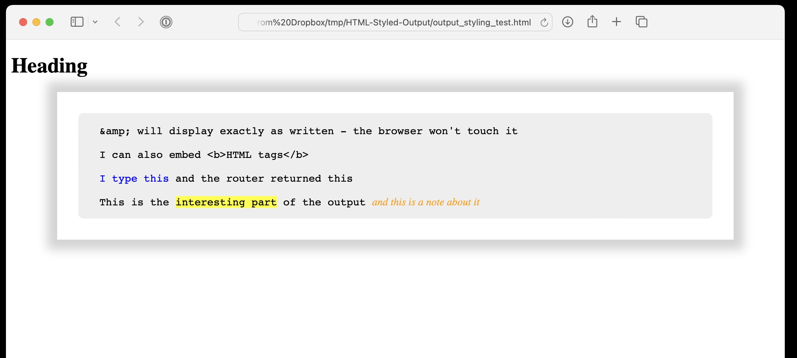

# HTML-Output-Styling
A handy way to embed output (code, router/switch configurations etc.) in HTML documents without any HTML entities being interpreted but with some styling still possible.
The objectives are:-

- Be able to embed blocks of output into a HTML document and have them display properly without any "special characters" being interpretted or obliterated by the browser
  - This is particularly useful when embedding code or router/switch configuration that may be useful to copy-and-paste to a target.
- Have the option to do a little light styling:-
  - When including instructions for configuring/troubleshooting a router or a switch, I like to highlight the bits I have typed vs. the bits that the router/switch has returned by colouring my inputs
  - It is useful to highlight the relevant parts within output
  - It is useful to be able to include annotations that are clearly distinguishable as such
  - It is useful to "grey out" output that is only included for context and not directly relevant
- The styling should be entirely optional: the option should exist to have the block unstyled and untouched by the browser

I came across a neat trick at https://stackoverflow.com/questions/11673978/is-there-a-html-css-way-to-display-html-tags-without-parsing describing how this might be done. The trick is to include the text in a <script type="text/plain">...</script> block. Then set a style for the script block:-

```
script {
    display: block;
}
```
This way, the browser will make no attempt to parse the contents of the block but just displays it "as is".

That ticks the first box, but there is no way to style the contents. To address that, I define a few styles:-

```
script.output {
    display: block;
}

div.output,
script.output {
	display: block;
    font-family: "Consolas", monospace;
    white-space: pre-wrap;
	padding: 0 2rem 1rem 2rem;
	border 1px dotted grey;
	background: #eee;
	border-radius: 0.5rem;
	margin: 1rem 0;
	border: none;
}

span.output__typed {
    color: blue;
}

span.output__highlight {
    background: yellow;
}

span.output__note {
    font-family: serif;
	font-style: italic;
    color: orange;
}

span.output__etc {
    font-family: serif;
	font-style: italic;
}
</style>
```

Then include a little Javascript:-
```
<script>
window.addEventListener("load", () => {
    document.querySelectorAll("script.output.colourise").forEach(div => {
        const REPLACEMENTS = { "&": "&amp;", "<": "&lt;", ">": "&gt;", }
        const STYLES = {
            "&lt;__typed__&gt;": "<span class=\"output__typed\">",
            "&lt;/__typed__&gt;": "</span>",
            "&lt;__context__&gt;": "<span class=\"output__context\">",
            "&lt;/__context__&gt;": "</span>",
            "&lt;__highlight__&gt;": "<span class=\"output__highlight\">",
            "&lt;/__highlight__&gt;": "</span>",
            "&lt;__note__&gt;": "<span class=\"output__note\">",
            "&lt;/__note__&gt;": "</span>",
            "&lt;__etc__&gt;": "<span class=\"output__etc\">",
            "&lt;/__etc__&gt;": "</span>",
        }
        let text = div.innerText
        for (r in REPLACEMENTS) {
            text = text.replaceAll(r, REPLACEMENTS[r])
        }
        for (r in STYLES) {
            text = text.replaceAll(r, STYLES[r])
        }
        const newdiv = document.createElement("div")
        newdiv.classList.add("output")
        newdiv.innerHTML = text
        div.parentElement.insertBefore(newdiv, div)
        div.remove()
    })
})
</script>
```
Finally, to style sections within a block, just wrap them in tags:-
- <\_\_typed\_\_>...</\_\_typed\_\_>
- <\_\_context\_\_>...</\_\_context\_\_>
- <\_\_highlight__>...</__highlight\_\_>
- <\_\_note\_\_>...</\_\_note\_\_>
- <\_\_etc\_\_>...</__etc\_\_>

The block of text needs both the "output" and "colourise" classes applied:-

```
<script class="output colourise" type="text/plain">
&amp; will display exactly as written - the browser won't touch it

I can also embed <b>HTML tags</b> 

<__typed__>I type this</__typed__> and the router returned this

This is the <__highlight__>interesting part</__highlight__> of the output <__note__>and this is a note about it</__note__>
</script>
```

The Javascript finds all <script>...</script> sections with both "output" and "colourise" classes attached and converts them to \<div\>...\</div\> sections, making some substitutions to preserve HTML entities and apply the requested styles

This is what the code below looks like:-



